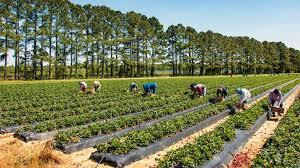

# Farm with AI 🌱

**Cultivating the Future of Agriculture, Intelligently**

A comprehensive, AI-powered agricultural platform designed to revolutionize farming by empowering farmers with intelligent tools, multi-language support, and modern digital resources.



## ✨ Features

### 🎯 Core Features
- **Multi-language Support** - English, Telugu, and Hindi content
- **AI-Powered Chatbot** - Agricultural advice and guidance
- **Beautiful Typography** - Modern design with Playfair Display and Inter fonts
- **Responsive Design** - Optimized for all devices
- **Smooth Animations** - Enhanced user experience with custom animations

### 📱 User Experience
- **Stunning Landing Page** - Hero section with typing animations
- **Secure Authentication** - Login/Signup with social media integration
- **Dynamic Dashboard** - Personalized farmer portal
- **Blog Integration** - Multi-language agricultural content
- **E-commerce Integration** - Direct links to agricultural products

### 🛠️ Platform Sections
- **Recent Blogs** - Latest agricultural news and techniques
- **Integrated E-Shop** - Essential farming equipment and supplies
- **Financial Tracking** - Loan status and government schemes
- **Marketplace** - Direct farmer-to-buyer connections
- **Freelance Advisory** - Expert farming consultation services

## 🚀 Technology Stack

- **Frontend**: React 18 + TypeScript
- **Build Tool**: Vite
- **Styling**: Tailwind CSS with custom design system
- **UI Components**: shadcn/ui
- **Routing**: React Router DOM
- **State Management**: React Query
- **Icons**: Lucide React

## 📦 Installation & Setup

### Prerequisites
- Node.js 18+ and npm
- Git

### Local Development

1. **Clone the repository**
   ```bash
   git clone <YOUR_GIT_URL>
   cd farm-with-ai
   ```

2. **Install dependencies**
   ```bash
   npm install
   ```

3. **Set up environment variables**
   ```bash
   cp .env.example .env
   ```
   
   Fill in the required environment variables:
   ```env
   VITE_SUPABASE_URL=your_supabase_url
   VITE_SUPABASE_ANON_KEY=your_supabase_anon_key
   VITE_EMAILJS_SERVICE_ID=your_emailjs_service_id
   VITE_EMAILJS_TEMPLATE_ID=your_emailjs_template_id
   VITE_EMAILJS_PUBLIC_KEY=your_emailjs_public_key
   VITE_GEMINI_API_KEY=your_gemini_api_key
   ```

4. **Start the development server**
   ```bash
   npm run dev
   ```

   The application will be available at `http://localhost:8080`

## 🏗️ Project Structure

```
src/
├── api/              # API integration modules
├── assets/           # Images, fonts, and static files
├── components/       # Reusable React components
│   ├── common/       # Shared components (Navbar, Footer, etc.)
│   └── ui/           # shadcn/ui components
├── hooks/            # Custom React hooks
├── pages/            # Page components
├── lib/              # Utility functions
├── styles/           # Global CSS and design system
└── main.tsx          # Application entry point
```

## 🎨 Design System

The application features a comprehensive design system with:

- **Agricultural Color Palette** - Greens, earth tones, and sunset colors
- **Custom Gradients** - Nature-inspired gradient combinations
- **Typography Scale** - Playfair Display for headings, Inter for body text
- **Component Variants** - Themed button and card variants
- **Animation Library** - Smooth transitions and engaging effects

## 🔧 Backend Integration

### Supabase Setup (Recommended)

1. **Create a Supabase Project**
   - Visit [supabase.com](https://supabase.com)
   - Create a new project
   - Note your project URL and anon key

2. **Configure Authentication**
   - Enable Email/Password authentication
   - Configure Google and Facebook OAuth providers
   - Set up user profiles table

3. **Database Schema**
   ```sql
   -- User profiles table
   CREATE TABLE profiles (
     id UUID REFERENCES auth.users(id) PRIMARY KEY,
     full_name TEXT,
     avatar_url TEXT,
     created_at TIMESTAMP WITH TIME ZONE DEFAULT NOW()
   );

   -- Enable RLS
   ALTER TABLE profiles ENABLE ROW LEVEL SECURITY;
   ```

### API Integrations

- **EmailJS**: Contact form email delivery
- **Google Gemini**: AI chatbot functionality
- **External APIs**: Product links and blog content

## 🚀 Deployment

### Netlify Deployment

1. **Build the project**
   ```bash
   npm run build
   ```

2. **Deploy to Netlify**
   - Connect your GitHub repository
   - Set build command: `npm run build`
   - Set publish directory: `dist`
   - Add environment variables in Netlify dashboard

### Environment Variables for Production
```env
VITE_SUPABASE_URL=your_production_supabase_url
VITE_SUPABASE_ANON_KEY=your_production_supabase_anon_key
VITE_EMAILJS_SERVICE_ID=your_emailjs_service_id
VITE_EMAILJS_TEMPLATE_ID=your_emailjs_template_id
VITE_EMAILJS_PUBLIC_KEY=your_emailjs_public_key
VITE_GEMINI_API_KEY=your_gemini_api_key
```

## 📝 Usage

### For Farmers
1. **Sign up** for a free account
2. **Choose your language** preference
3. **Explore blogs** in your native language
4. **Browse the e-shop** for farming essentials
5. **Use the AI chatbot** for farming advice
6. **Access financial tools** and government schemes

### For Contributors
1. Fork the repository
2. Create a feature branch
3. Make your changes
4. Test thoroughly
5. Submit a pull request

## 🌟 Key Features Implementation

### Multi-language Support
- Dynamic content switching
- Blog content in English, Telugu, and Hindi
- Language-specific search functionality

### AI Chatbot Integration
- Google Gemini API integration
- Agriculture-focused prompts
- Real-time conversation interface

### E-commerce Integration
- Product categorization system
- External marketplace links
- Dynamic product shuffling

### Responsive Design
- Mobile-first approach
- Tablet and desktop optimizations
- Touch-friendly interfaces

## 🔒 Security Considerations

- Environment variables for sensitive data
- Secure authentication with Supabase
- Input validation and sanitization
- HTTPS enforcement in production

## 🤝 Contributing

We welcome contributions from the community! Please see our contributing guidelines and feel free to submit issues and feature requests.

## 📄 License

This project is developed by **Team Agri-Hackers** for the farming community.

## 👥 Team

**Farm with AI - Team Agri-Hackers**
- Email: team@farmwithai.com
- Website: [Farm with AI](https://farmwithai.com)

---

**Made with ❤️ for farmers worldwide** 🌾

*Cultivating the Future of Agriculture, Intelligently*